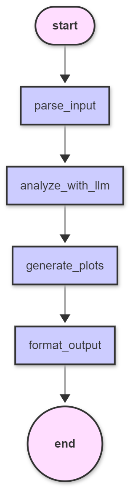

## cloudwatch-langraph-agent

An AWS Bedrock–powered analysis service built with LangGraph and Flask. It ingests CloudWatch-like monitoring payloads and returns a structured, actionable incident analysis. Optional utilities include AWS Lambda handlers that fetch CloudWatch metrics and notify via SNS or SES, plus a CPU stress test script to generate load along with langsmith tracing.

### Key Features
- Structured JSON analysis from arbitrary monitoring payloads using Bedrock LLMs via LangChain
- Simple HTTP API with file upload or JSON body
- Optional time-series plot generation (as base64 PNG data URIs)
- Containerized with uv for fast, reproducible Python builds
- Ready-to-run ECS Fargate task definition and health check
- Lambda utilities for:
  - Fetching EC2 CPU metrics across multiple lookbacks
  - Sending analysis via SNS or SES (HTML emails with embedded plots)
  - Optional storage of analysis responses to S3

---

## Architecture Overview

- `src\api.py`: Primary Flask app exposing `/health` and `/analyze`. Builds a LangGraph with nodes: `parse_input` → `analyze_with_llm` → `generate_plots` → `format_output`. Uses `matplotlib` to create plots when time-series data is detected.
- `api.py`: A smaller variant of the API without CORS and plotting; kept as a reference/minimal version.
- `cloudwatch_trigger_lambdas/`: Lambda handlers that construct CloudWatch queries, call the analysis endpoint, and notify via SNS or SES.
- `cpu_stress_test/load_test.py`: Multi-process CPU stress generator to help trigger CloudWatch alarms.
- `Dockerfile`: Production image using `ghcr.io/astral-sh/uv` for fast dependency resolution and execution.
- `task-definition.json`: Example ECS Fargate task definition wiring env vars, logs, health checks, and port mappings.

---

## AI Workflow Diagram


---

## Architecture Diagram



Source (Mermaid): `architecture/architecture.mmd`

---

## Requirements

- Python 3.12+
- AWS account with Bedrock access to the selected model
- AWS credentials configured via environment variables or IAM when running in AWS

### Core Python dependencies
Declared in `pyproject.toml`:
- `flask`, `flask-cors`, `langchain`, `langchain-aws`, `langgraph`
- `matplotlib`, `seaborn`, `python-dotenv`

---

## Configuration

The service is configured via environment variables:

- Model and provider
  - `MODEL_ID` (default `us.anthropic.claude-sonnet-4-20250514-v1:0`)
  - `BEDROCK_PROVIDER` (default `bedrock_converse`)
  - `AWS_REGION` (default `us-west-2`)
  - `MODEL_TEMPERATURE` (default `0.2`)
  - `MODEL_MAX_TOKENS` (default `64000`)

- AWS credentials (optional when running outside AWS roles)
  - `AWS_ACCESS_KEY_ID`, `AWS_SECRET_ACCESS_KEY`, `AWS_SESSION_TOKEN`

- Tracing (optional LangSmith/LangChain)
  - `LANGSMITH_API_KEY`, `LANGSMITH_PROJECT`, `LANGSMITH_ENDPOINT`
  - `LANGCHAIN_API_KEY`, `LANGCHAIN_PROJECT`, `LANGCHAIN_ENDPOINT`, `LANGCHAIN_TRACING_V2`

- Server
  - `PORT` (default `6000`)
  - `LOG_LEVEL` (default `DEBUG`)

Lambda utilities also read:
- `ANALYSIS_ENDPOINT` (public or internal URL to this service’s `/analyze`)
- `SNS_TOPIC_ARN` (for SNS notifier variant)
- `SENDER_EMAIL`, `RECIPIENT_EMAIL` (for SES notifier variants)
- `S3_BUCKET`, `PRESIGN_EXPIRATION` (for S3 storage utility)

Create a local `.env` if desired:

```
MODEL_ID=us.anthropic.claude-sonnet-4-20250514-v1:0
AWS_REGION=us-west-2
LOG_LEVEL=DEBUG
PORT=6000
```

---

## Running Locally

### Using uv (recommended)
The Docker image uses `uv`, but you can also run locally with it.

```bash
# From repo root
uv sync --locked --no-dev
uv run src\api.py
# Service listens on http://localhost:6000
```

### Using plain Python
```bash
python -m venv .venv
. .venv/bin/activate  # Windows: .venv\Scripts\activate
pip install -U pip
pip install -r <(uv pip compile pyproject.toml -q)  # or install per pyproject with your tool
python src\api.py
```

---

## API

Base URL: `http://localhost:6000`

- `GET /health`
  - Returns `{ "status": "ok", "model_id": "..." }`

- `POST /analyze`
  - Content types:
    - `multipart/form-data` with `file` field containing JSON
    - `application/json` body
  - Response: structured JSON including keys like `summary`, `advice`, `severity`, `recommendations`, `diagnostics`, `raw_findings`, and optionally `plots`.

### Examples

Send JSON body directly:
```bash
curl -sS http://localhost:6000/analyze \
  -H "Content-Type: application/json" \
  -d @sample_data/20251028T083107Z.json | jq .
```

Upload a file (multipart):
```bash
curl -sS -F "file=@sample_data/20251028T083107Z.json;type=application/json" \
  http://localhost:6000/analyze | jq .
```

Response shape (illustrative):
```json
{
  "summary": "...",
  "advice": "...",
  "severity": "HIGH",
  "confidence": 0.86,
  "recommendations": [ { "title": "...", "what": "...", "why": "...", "effort": "low", "priority": "P1" } ],
  "diagnostics": ["aws cloudwatch ...", "journalctl -u ..."],
  "raw_findings": { "metric": {"metric_name": "CPUUtilization"}, ... },
  "plots": [ { "name": "cpu_last_15_min", "data_uri": "data:image/png;base64,..." } ]
}
```

Time-series plots are generated when the payload contains timestamped series (e.g., `metric_data_by_range` from Lambda).

---

## Docker

Build and run locally:
```bash
docker build -t new-langraph-agent:local .
docker run --rm -p 6000:6000 \
  -e MODEL_ID=us.anthropic.claude-sonnet-4-20250514-v1:0 \
  -e AWS_REGION=us-west-2 \
  new-langraph-agent:local
```

Notes:
- Image is based on `ghcr.io/astral-sh/uv:python3.12-bookworm-slim`.
- The container’s default `CMD` is `uv run src\api.py`.

---

## AWS ECS (Fargate)

An example task definition is provided in `task-definition.json`:
- Sets environment for model config, tracing, and `PORT=6000`
- Health check: `curl -f http://localhost:6000/health`
- Logs to CloudWatch via `awslogs`

Typical steps:
1. Build & push image to ECR.
2. Create/update task definition using `task-definition.json` (adjust ARNs, image URI).
3. Run on Fargate with an ALB or NLB; ensure security groups allow port 6000.

IAM roles referenced:
- `taskRoleArn`: app permissions if needed (usually minimal for this service)
- `executionRoleArn`: pull from ECR, write logs

---

## Lambda Utilities

Directory: `cloudwatch_trigger_lambdas/`

- `lambda_function.py` (Main Lambda):
  - Fetches EC2 CPU metric data for multiple lookbacks, calls `/analyze`, sends analysis response in a through SES, using raw json and base64.


Required env vars (depending on variant): `ANALYSIS_ENDPOINT`, `SNS_TOPIC_ARN`, `SENDER_EMAIL`, `RECIPIENT_EMAIL`, `S3_BUCKET`.

Event shape: Supports SNS-wrapped CloudWatch alarm events and direct-invoke payloads. Extracts `instance_id`, `AlarmName`, and builds `metric_data_by_range` in the request sent to `/analyze`.

---

## CPU Stress Test

Script: `cpu_stress_test/load_test.py`

Purpose: Generate variable CPU load across all cores to help trigger CPU utilization alarms.

Run:
```bash
python cpu_stress_test/load_test.py
```
```bash
uv run cpu_stress_test/load_test.py
```

Behavior:
- Spikes CPU on all cores for 5 minutes; then waits a random interval (1–15 minutes); repeats.
- Press Ctrl+C to stop; script cleans up worker processes.

---

## Sample Data

`sample_data/20251028T083107Z.json` contains a representative payload to test `/analyze` locally.

---

## Sample Report

`sample_email_report/report.pdf` contains a representative output from email in pdf format.

---

## Troubleshooting

- 401/403 or model errors: Verify Bedrock access to `MODEL_ID` and correct `AWS_REGION`.
- LangChain import errors: Ensure `langchain` and `langchain-aws` versions meet requirements in `pyproject.toml`.
- Empty or invalid JSON from model: The API attempts to extract JSON from fenced code blocks or via brace matching. Check logs and adjust prompts if needed.
- Plots missing: Ensure payload includes timestamped series; see `metric_data_by_range` format produced by Lambdas.
- CORS: `src\api.py` enables CORS via `flask-cors`. Adjust if deploying behind internal ALBs.

Logs: Controlled by `LOG_LEVEL`. ECS task definition configures `awslogs`.

---

## Security Notes

- Do not bake long-lived AWS credentials into images. Prefer task roles/instance profiles.
- Restrict access to the `/analyze` endpoint if it’s exposed publicly.
- Validate and size-limit uploads; current limit is 5 MB (see `MAX_CONTENT_LENGTH`).

---


